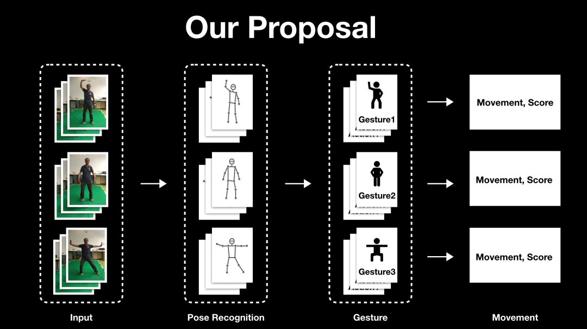
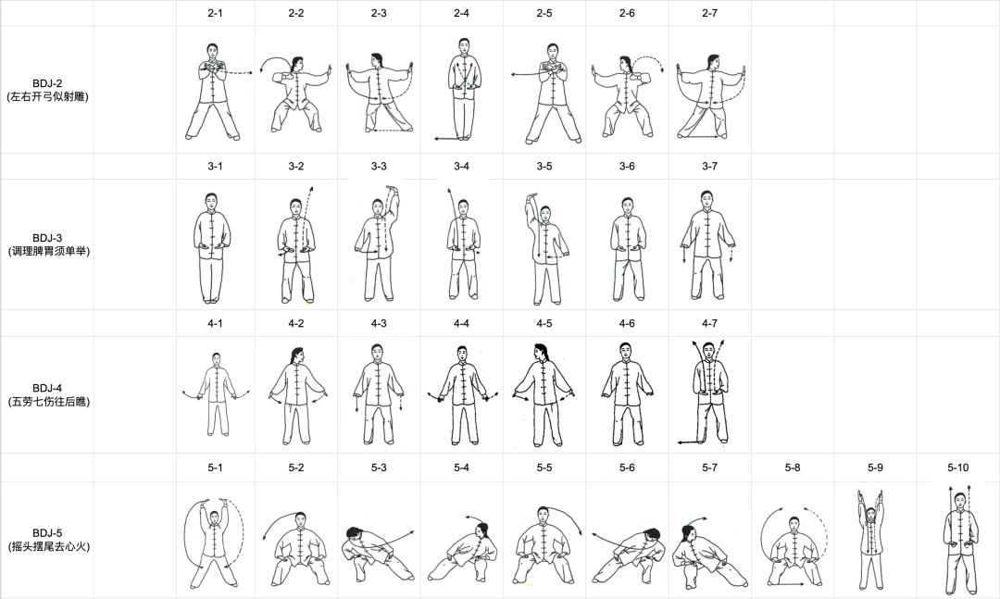
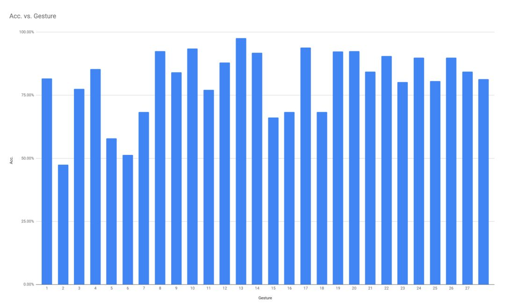
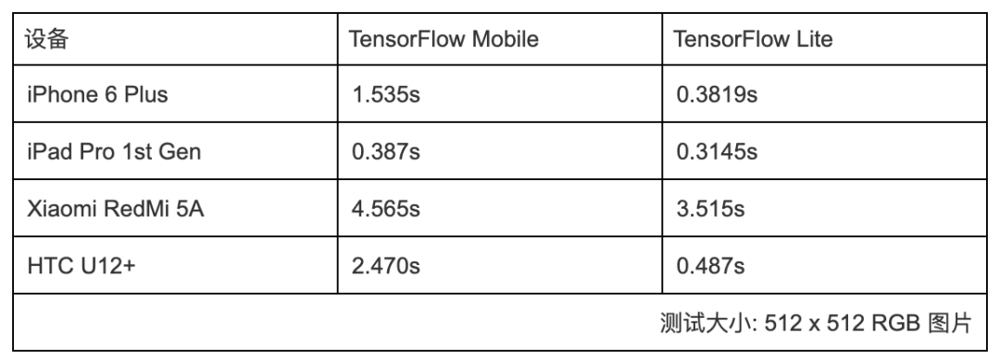

## 项目背景

OliveX 是一家专注于健身领域软件研发的公司，自第一款产品上线以来已经服务超过 200 万用户。
我们都知道健身软件的主要使用人群是青年和中年人，但随着智能手机的普及，越来越多老年人也在使用智能手机，而我们希望能够也帮助这些老年人。
在众多老年人的健身运动中，流行最广的项目之一是健身气功“八段锦”，因此我们希望可以从跟这个运动入手来帮助老年人养成健身习惯，以及在运动中减少受伤的可能性。同时，我们希望借助于人工智能的辅助，识别老年人进行八段锦运动的姿势，并且有针对性的提供反馈。

---

  

---

八段锦是一种在中国古代发明的健身方法，由八种肢体动作组成，内容包括肢体运动和气息调理。八段锦依据人体的骨骼、关节、内脏器官等生理结构创编的，对外在的自我锻炼和内在的调理达到内外兼修的目的。

八段锦和五禽戏、太极拳等，都是中国民间广为流传的健身方法。2003 年，中国国家体育总局把重新编排后的八段锦等健身法作为“健身气功”的内容向全国推广。

“智能八段锦”这个项目的最终目标是希望可以创造一个人工智能的八段锦助手，而这个基于人工智能的助手可以帮助用户来判断他们练习的动作做的是否标准，以及对他们的八段锦动作进行打分。我们希望通过引入人工智能的相关功能，改进传统的单纯依照视频锻炼的方法。为普通的锻炼提供更多的交互性和反馈，我们也希望这些功能可以帮助老年人更加有效的练习八段锦。

  

在对以上的项目需求进行分析梳理之后，我们定义了以下几个核心使用场景：

> * 用户进行八段锦锻炼的主要场所是在户外，因此我们的 App 需要运行在移动端。

> * 用户在进行八段锦锻炼时，通常需要观看视频教程，以及播放口令录音。

> * 我们希望通过前置摄像头采集用户运动数据，并给出反馈。

而对于姿势识别部分，我们希望我们的算法可以做到以下几点：

> * 该算法需要可以识别到每一个具体的姿势。

> * 该算法可以对姿势的正确程度做出评分。

> * 该算法可以对不正确的姿势提出改正意见。

---

## 技术方案

### 技术调研

基于以上的需求，我们希望可以选择的深度学习框架可以支持以下几点：

> * 对移动端有良好的支持，其模型推理可以在中低端手机上流畅运行。

> * 友好的接口设计以及丰富的调试工具。

> * 成熟的技术社区支持。

通过技术调研，我们发现 Google 开源了PoseNet 的算法库，并且实现了在 JavaScript 平台的示例程序。这样，Google 即帮助我们完成了初期的人体骨骼的识别工作，而且由于在 JavaScript 平台的性能表现，让我们充分相信我们的运动识别算法也可以在移动端运行。

---

### 算法方案

#### 姿势识别

在项目预研阶段，我们对现有的运动识别算法进行了调研。目前主流的动作类型识别算法基本都是基于连续的视频序列帧。虽然其准确率达到我们需求，但是整体网络都比较复杂，其推断计算需要大量的计算资源。而我们的目标是希望运行在移动设备上，因此，我们不得不在识别准确度和计算速度之间进行权衡。

我们采取的策略是首先利用 PoseNet 获取人体骨骼信息，然后再基于人体骨骼的序列进行具体姿势和运动类型的识别。而通过 PoseNet 获取的骨骼信息只有17个关键点的位置信息，相比较于一幅图像，其需要处理的数据已经大大减少了。下图所示即为算法的处理流程，首先我们利用PoseNet将输入的视频转换为连续的骨骼数据，然后在骨骼数据的基础上按照关键姿势进行分类。

---

#### 关键姿势的定义

在确定策略之后，首先需要定义我们需要识别的关键姿势。于是我们将具体的姿势识别转化为一个分类问题。下图就是我们根据八段锦的教程定义的部分关键姿势。

分类的算法我们采用的是传统的 DNN 网络进行计算，通过多次的调整参数和优化训练数据，最后的计算结果还算不错，在实际应用中完全符合我们的需求。

---

除了模型的开发外，我们的下一步挑战是把所有的模型应用在移动设备上，包括主流的两个手机平台 iOS 和 Android。在刚开始的时候，我们第一个方案是使用 TensorFlow Mobile。由于我们需要检测实时动作，TensorFlow Mobile的效率并不足以满足我们的需要。

正当我们致力于解决运算效率的问题的时候，TensorFlow 发布了Lite版本。TensorFlow Lite在移动平台上的效率有了重大突破。

以下是我们在不同的移动设备上测试的运算时间:

---

根据现在的情况，在大部分 Android 手机上都无法实时进行运动检测。而在所有的模型当中，我们采用的 PoseNet 的运算最为复杂，也用时最长，占总运算时间的 95% 以上。所以我们根据需要，再重新调整 PoseNet 的输入大小和参数，与此同时我们重新训练了姿势分类算法来弥补输入精度的缺失。最后我们用的是 337 x 337 RGB 输入的大小，而且在 Android 上使用了 0.5 作为 MobileNet 的宽度参数。

因为我们产品的目标用户群为老人家，他们所使用的手机配置普遍较低。虽然在 PoseNet 参数调整后，效能有明显的改善，但在低配置手机上仍然未如理想。所以我们便着手研究使用手机中的 GPU 来加速计算。而恰好这时 TensorFlow Lite GPU delegate (experimental) 推出，节省了我们大量的研发时间。在 GPU 中，算法的运算效率也得到大幅提升。

以下是我们在调整 PoseNet 参数后在不同的移动设备上测试 Lite 和 Lite GPU 的运算时间。

因为八段锦中的动作相对较慢，所以我们在使用TensorFlow Lite GPU delegate (experimental) 后，大部分市面上的手机都可以正常使用。

---

## 结语

我们最终成功的在 iOS 以及 Android 平台上完成了八段锦项目，并且在用户测试中得到了不少积极的反馈。利用姿势的识别，我们提供了引导模式，帮助八段锦新手一步一步的跟着老师进行锻炼。对于经常锻炼八段锦的用户，我们提供了评分反馈等功能。目前“智能八段锦”这个应用可以在苹果的 App Store 和 Google Play 上下载到。

与此同时，OliveX 还在积极探索人体姿势识别在其他健身运动中的使用。我们发现在日常很多健身运动和八段锦一样，姿势的正确与否非常重要。正确的姿势可以更好的保护身体不受损伤，以及更好的提高运动效率。因此我们希望能将在八段锦项目中的姿势识别和纠正的算法应用在其他的运动场景。

---

